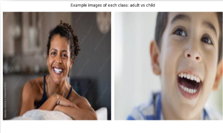
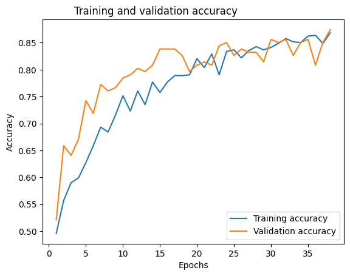
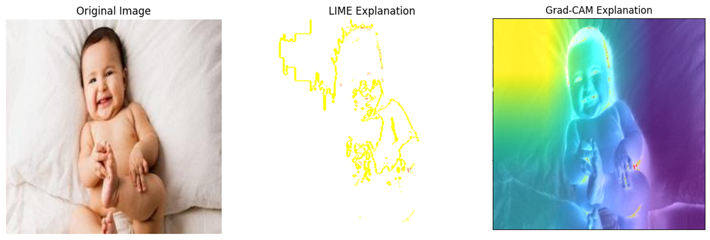

# 👋 Luz-Triagix: Deep Learning-based Image Classifier App

## 🤓 Project overview

This was my third university project. It was completed in April of 2022, this project was my first introduction to Deep Learning.

The objective of this project was to create a Deep Learning-based Image Classifier App prototype for a business case of our choice.

---

**Important Note:** This project is not yet complete. There is still a significant amount of code missing, and I have several improvements I would like to make. However, I may not have the time to dedicate to it in the foreseeable future. That said, I’ve organized and prepared what I currently have to the best of my ability. The missing sections and potential improvements are outlined at the end.

---

## Skills I learned

Creating this project helped me develop key skills, including:

- **Deep Learning concepts**: learning rate, gradient descent, loss functions, batch size, and the roles of various layer types
- **Neural Networks**: MLP, CNN
- **TensorFlow framework**
- **Transfer Learning**: using architectures like ResNet50, VGG16, and VGG19
- **Explainable AI technique**s: GradCAM, LIME
- **Model evaluation**: Understanding key metrics like accuracy and working towards improving error analysis.
- The importance of **Market Research** and target segmentation when crafting a business proposal and defining a problem statement

In the following sections, I’ll briefly describe key components of the project. For a more detailed explanation, including all project aspects, feel free to view the [**presentation**](https://github.com/FranciscoRMansilha/LuzTriagix/blob/a2b67ab30be8abfcd221c3fa2128ae49c14b3208/documents/Project%20Presentation.pdf) I’ve prepared. While I typically avoid lengthy presentations, this one provides a thorough overview in the absence of a live presentation. However, feel free to keep reading if you just want a general overview of the project!

## Problem statement/Idea

Hospitals are facing a critical shortage of healthcare workers, which affects the quality and efficiency of patient care. A CNN image classifier that can identify adults and children from images can help optimize the roles of existing staff by triaging patients and directing them to the appropriate services.

## Dataset

The sources of the dataset were images from the Imsitu dataset and images I collected with Google Image Scraper.

## Model Training

The model I built for this scenario is a binary classification model. This repository includes one baseline model and two iterations, which can be found in this [**folder**](https://github.com/FranciscoRMansilha/LuzTriagix/tree/28fe1931e3a832b46a08dc73cbc7eafc3e19b59e/code). In reality, the project went through many more iterations, and throughout my bachelor's degree, as I worked on this project, I also studied and learned a lot about deep learning theory.
 

In the end, using VGG16 for Transfer Learning and a simple custom architecture I was able to reach an accuracy of 78% on the test set.

## Explainable AI

In this project I got to learn and apply Explainable AI methods such as LIME and Gradcam, I found them fascinating and crucial in a world where transparency in AI is more important than ever.

## Human Centered AI - an app prototype

You can find a short video tutorial of the app [**here**](https://github.com/FranciscoRMansilha/LuzTriagix/blob/263eac505d58b927e142af8f0cb953e2a778b73b/media/LuzTriagix%20tutorial.mp4). If you would like to test the prototype too you can find it in this [**folder**](https://github.com/FranciscoRMansilha/LuzTriagix/tree/263eac505d58b927e142af8f0cb953e2a778b73b/Luz-Triagix-Prototype).
---

## What is currently missing?

- **Data Preprocessing**: The Google Image Scraper and certain data cleaning steps are still missing.

- **Data Augmentation**: Adding more data augmentation techniques, like rotations or zooms, could help enhance model performance and generalization.

- **Hyperparameter Tuning**: Incorporating basic hyperparameter tuning (e.g., adjusting learning rates or adding Grid/Random Search) could further optimize the model.

- **Error Analysis Improvements**: Although there’s some analysis, it should be refined

- **Integration into the App**: Completing the integration of the final model into the Luz-Triagix app interface (which was just a prototype itself too).

## What would I have done differently

Looking back, I might have reconsidered the project concept itself, as the idea may not be entirely practical in its current form. If I were to deploy a deep learning-based image classifier today, I would make sure to gather data that better reflects real-life use cases, as high-quality images scraped from Google don’t match the quality of most phone cameras. I would also invest more time in hyperparameter tuning and model optimization, as I now have a stronger understanding of deep learning compared to when I started this project. However, this was just my first experience with deep learning and I was quite satisfied with all the concepts I was able to learn.

---

Feel free to ask me any question about this project 🙂

You can contact me at:

- francisco.ribeiro.mansilha@gmail.com
- [Linkedin profile](https://www.linkedin.com/in/francisco-mansilha/)
